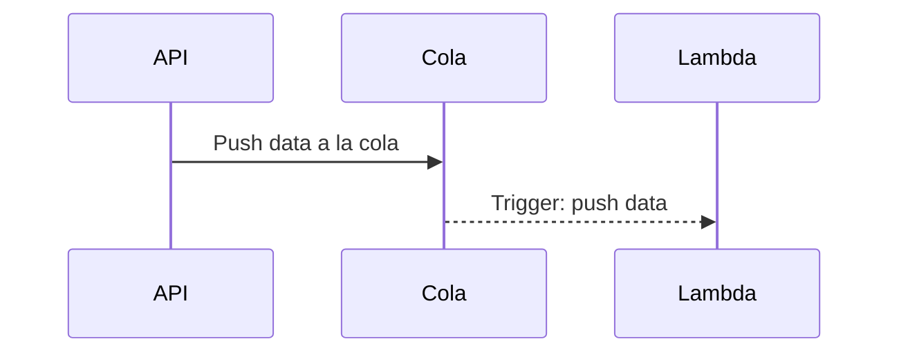

# Colas SQS

Este es un ejemplo sencillo y muy básico que utiliza aws sqs

## Instalación proyecto

```sh
cd api
npm i
node api.js
```

```sh
cd lambda
sls deploy
```


## Funcionalidad





-----------

FIFO
- Un poco mas caro
- 1 solo evento no duplicados
- $ 0.50 x millon


Standard
- no hay garantia del orden
- duplicacion es posible
- $ 0.40 x millon


**Visility timeout:** lock o timeout en que puede visualizarse un mensaje, para que nadie mas lo vea

**Message retention period:** retencion por si ocurre un error, mejor para DLQ, colas normales debe ser bajo.

256KB limite mensaje

**Delivery delay:** tiempo en que esta disponible para ser procesado después de ser agregado a la cola.

**Receive message wait time:** tiempo en que puedes consultar a la cola
DLQ: cola para manejo de fallas

Trigger:

**batch size:** cantidad de eventos enviados al lambda

**Message Attributes:** metadata


https://www.youtube.com/watch?v=PXX8_3ENc2o

https://www.youtube.com/watch?v=JJQrVBRzlPg
