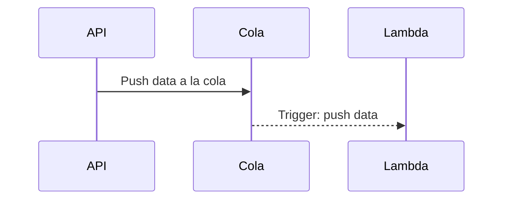

# Colas SQS

Este es un ejemplo sencillo y muy básico que utiliza aws sqs

## Instalación proyecto

```sh
cd api
npm i
node api.js
```

```sh
cd lambda
sls deploy
```


## Funcionalidad



```mermaid
sequenceDiagram
API ->> Cola: Push data a la cola
Cola -->> Lambda: Trigger: push data


```